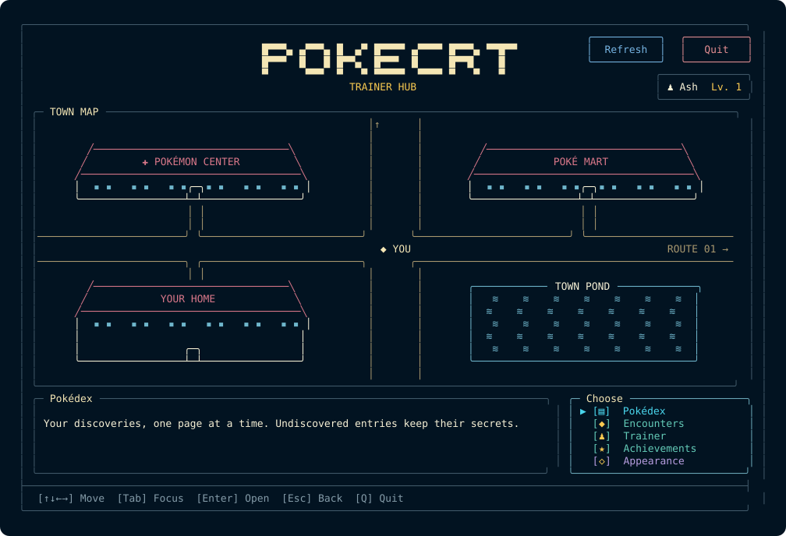

<div align="center">

# PokéCRT

**Your terminal. Your Pokémon journey. Entirely offline.**

Natural-size Pokémon artwork, a searchable catalog, and a local trainer adventure-one executable.

[Download v1.0](https://github.com/mayanklad/pokecrt/releases/tag/v1.0) &nbsp; / &nbsp; [Install](#install-in-a-minute) &nbsp; / &nbsp; [Full guide](docs/guide.md) &nbsp; / &nbsp; [Release notes](docs/release-v1.0.md)

[](https://github.com/mayanklad/pokecrt/releases/tag/v1.0)
[](docs/release-v1.0.md#platform-and-terminal-requirements)
[](docs/guide.md#prepare-a-source-checkout)
[](LICENSE)

**Linux amd64 · Keyboard & mouse · No network at runtime**

</div>



## A little adventure, wherever you open a terminal

Print a favorite Pokémon, add a sprite to your shell, or open the Adventure Menu and build a collection through encounters. Artwork and metadata are embedded; saved progress stays on your machine.

| Artwork & catalog | Your trainer journey |
| --- | --- |
| Print named, random or filtered Pokémon. Choose exact forms, shiny palettes and supported visual genders. | Create local trainers, record encounters, gain XP and unlock 50 achievement goals. |
| Browse all 1,025 species across nine generations. Public catalog access is independent of saved progress. | Explore your private Pokédex, collected appearances, evolution families and encounter history. |
| Natural-size truecolor artwork, transparent backgrounds and `NO_COLOR` support. | Responsive pages, keyboard and mouse controls, and four live appearance choices. |

## Install in a minute

Download the **Linux amd64 archive** and **SHA256SUMS** from [v1.0](https://github.com/mayanklad/pokecrt/releases/tag/v1.0), then run from their directory:

```bash
sha256sum -c SHA256SUMS
tar -xzf pokecrt_v1.0_linux_amd64.tar.gz
mkdir -p "$HOME/.local/bin"
install -m 0755 pokecrt "$HOME/.local/bin/pokecrt"
"$HOME/.local/bin/pokecrt" --version
```

If `~/.local/bin` is not on your PATH, add `export PATH="$HOME/.local/bin:$PATH"` to your shell configuration and open a new shell.

### Install from source

Use Go 1.27.0 or newer. Asset preparation downloads verified inputs once; the built app runs offline.

```bash
git clone https://github.com/mayanklad/pokecrt.git
cd pokecrt
git checkout v1.0
go run ./tools/dataset \
  --sources tools/dataset/sources.json \
  --cache .cache/dataset \
  --mappings tools/dataset/mappings.json \
  --out . --fetch --prepare-assets --check
go build -o bin/pokecrt ./cmd/pokecrt
sh scripts/install.sh ./bin/pokecrt
```

[Build checks and packaging](docs/guide.md#build-and-verify) · [Uninstall or reset](docs/guide.md#uninstall)

## Start exploring

```bash
# Open the interactive adventure; first launch offers trainer creation.
pokecrt tui

# Print a favorite, or let the app pick one.
pokecrt print --name charizard
pokecrt print

# Explore exact appearances and the public catalog.
pokecrt print --name charizard --form mega-x --shiny
pokecrt list --name eevee --details
```

### Record an encounter

```bash
# Create and activate a local trainer, then record an encounter.
pokecrt trainer create Ash
pokecrt trainer use Ash
pokecrt encounter

# Review progress without recording another encounter.
pokecrt trainer
pokecrt dex
```

`encounter` records the encounter and awards progression. Printing, catalog listing and private browsing do not record encounters. [Profiles and encounter options](docs/guide.md#encounters) explain how to switch trainers and choose output modes.

The Adventure Menu brings together **Pokédex, Encounter, Trainer and Achievements**. Use arrows or Tab to move, Enter to select, and Esc to return. Mouse controls are available throughout. Switch among Dark, Light, Follow Terminal and Terminal Native appearances; saving a default is explicit.

For shell integration, filters, trainer commands and detailed controls, open the [full guide](docs/guide.md).

## Good to know

- **Terminal:** UTF-8 required; truecolor gives the intended artwork. TUI requires terminal input/output and at least **40×12**. Wide views provide more space for artwork and simultaneous panels.
- **Coverage:** 1,025 catalog species and 2,669 accepted exact assets. Some appearances are unavailable; PokéCRT never substitutes another sprite. See [coverage](tools/dataset/coverage.md).
- **Local data:** printing and the public catalog need no trainer. Encounters are explicit; browsing does not change progression. Updating the binary preserves profiles and settings.
- **Artwork:** sprites retain their natural dimensions; narrow terminals may wrap public output. Follow Terminal depends on your terminal’s background replies and falls back to native colors.

## Read more

[Guide](docs/guide.md) · [v1.0 notes](docs/release-v1.0.md) · [Progress](docs/progress.md) · [Benchmarks](docs/benchmarks.md)

PokéCRT is an unofficial fan project, inspired by [pokemon-colorscripts](https://gitlab.com/phoneybadger/pokemon-colorscripts), [pokego](https://github.com/rubiin/pokego) and [poketerm](https://github.com/chris-wood-mo/poketerm). Artwork provenance is recorded in the [source audit](https://github.com/mayanklad/pokecrt/blob/v1.0/tools/dataset/README.md).

Original source is [MIT licensed](LICENSE). Third-party code, metadata and Pokémon artwork retain their respective terms. See [licensing](LICENSING.md), [notices](THIRD_PARTY_NOTICES.md) and [release policy](docs/release-policy.md). No endorsement or rights-holder permission is claimed.
